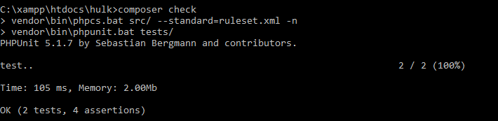

# hulk

[](https://travis-ci.org/happyoniens/hulk)

PHP MVC Framework inspired by [Flight](https://github.com/mikecao/flight)

###Get started

####Variables
Save variable in Hulk
```php
Hulk\Hulk::set('name','value');
```
Get saved variable
```php
Hulk\Hulk::get('name');
```

####Add path to autloading
```php
Hulk\Hulk::path('foo/');
```
####Register class
```php
Hulk\Hulk::register('name', 'className', ['params']);
```
####Use registered class
```php
$class = Hulk\Hulk::name();
```
or run functions directly
```php
Hulk\Hulk::name()->myFunc();
```

###Development
If you want to check if the written code passes the codestyle guidelines and the unit tests you can run the command ```composer check``` in your development directory.



##Features
- [ ] Input Validation
- [ ] Query Builder
- [ ] Form from Model
- [ ] Template Engine
- [ ] Routing
- [ ] ...

##Contributors
- happyoniens
- gabriellovric
